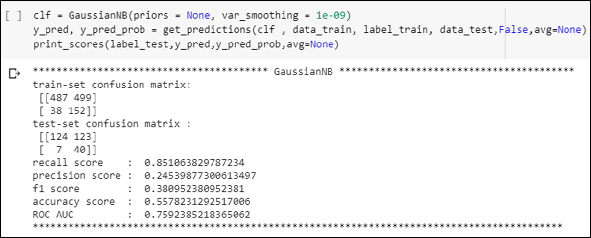

# HR-Analytics - Attrition Prediction

  

## INTRODUCTION
My client is a large MNC and they have 9 broad verticals across the organisation. One of the problem my client is facing is around identifying the people who are at risk of "atrrition".
Hence,the company needs a help in identifying the probable candidates at a particular checkpoint so that they can take preventive measures to mitigate the "attrition risks. Below is a table showing names of all the columns and their description. 
Below is a table showing names of all the columns and their description.

## DATA
| Column Name              | Description                                                                     |
| -------------            | -------------                                                                   | 
| Age                      | Age  Details                                                                    |
| Attrition                | Attrition  Details                                                              |
| BusinessTravel           | BusinessTravel  Details                                                         |
| DailyRate                | DailyRate  Details                                                              |
| Department               | Department Details                                                              |
| DistanceFromHome         | DistanceFromHome  Details                                                       |
| Education                | Education  Details                                                              |
| EducationField           | EducationField  Details                                                         |
| EmployeeCount            | EmployeeCount Details                                                           |
| EmployeeNumber           | EmployeeNumber  Details                                                         |
| EnvironmentSatisfaction  | EnvironmentSatisfaction  Details                                                |
| Gender                   | Gender  Details                                                                 |
| HourlyRate               | HourlyRate Details                                                              |
| JobInvolvement           | JobInvolvement  Details                                                         |
| JobLevel                 | JobLevel  Details                                                               |
| JobRole                  | JobRole  Details                                                                |
| JobSatisfaction          | JobSatisfaction Details                                                         |
| MaritalStatus            | MaritalStatus  Details                                                          |
| MonthlyIncome            | MonthlyIncome  Details                                                          |
| MonthlyRate              | MonthlyRate  Details                                                            |
| NumCompaniesWorked       | NumCompaniesWorked Details                                                      |
| Over18                   | Over18  Details                                                                 |
| OverTime                 | OverTime  Details                                                               |
| PercentSalaryHike        | PercentSalaryHike  Details                                                      |
| PerformanceRating        | PerformanceRating Details                                                       |
| RelationshipSatisfaction | RelationshipSatisfaction  Details                                               |
| StandardHours            | StandardHours  Details                                                          |
| StockOptionLevel         | StockOptionLevel Details                                                        |
| TotalWorkingYears        | TotalWorkingYears  Details                                                      |
| TrainingTimesLastYear    | TrainingTimesLastYear  Details                                                  |
| WorkLifeBalance          | WorkLifeBalance Details                                                         |
| YearsAtCompany           | YearsAtCompany  Details                                                         |
| YearsInCurrentRole       | YearsInCurrentRole  Details                                                     |
| YearsSinceLastPromotion  | YearsSinceLastPromotion Details                                                 |
| YearsWithCurrManager     | YearsWithCurrManager Details                                                    |

## PROJECT ANALYSIS
| Description | Analysis |
| --- | --- |
| Distribution of Attrition  |  |
| Heatmap showing Correlation |  |

### CONCLUSION

|     | Models Analysed |
| --- | ---             |
| Approach 1 - UnderSampling                          |  |
| Approach 1 - Smote                                  |  |
| Approach 2 - Dropping Columns with Constant Data    |  |
| Approach 3 - Dropping Columns having no correlation |  |
| Approach 4 - PCA                                    |  |
| Approach 5 - Using correlation columns              |  |
| Approach 6 - Using correlation-labelencoder/backward|  |
| Approach 7 - SVC                                    |  |
| Approach 7 - TPOT                                   |  |

#### Observation
##### Based on the data available we try the following approaches to see if the model built on these gives a good accuracy.
- Check a Model by using SMOTE/UnderSampling techniques to create a new dataset due to imbalanced data of attrition.
- Check a Model by using feature engineering(dropping columns with constant data or std dev=0).
- Check a Model by using feature engineering(dropping columns having no correlation).
- Check a Model by using columns which has only correlated data with attrition. Check also using Label encoder for nominal and Backward Difference Encoding for ordinal.
- Check a Model by using PCA.
- Check a Model by using SVC.
- Check a Model by using TPOT.

The best model that was found for achieving the best recall score were GaussianNB and BernoulliNB which gave the recall scores of 82% and 57% respectively. However, there are few things to note before making a final selection of the model. 

-Though the recall score is 82% for GaussianNB but the precision is pretty low 24%. This means the model though is able to identify 82% of the attrition cases accurately but it is also misclassifying 76% of non attrition cases as attrition. And, if we were to implement this model then it would involve a lot of work to the HR team to implement its mitigation policy or retention policy as this would mean potentially running through more than half the population to try and convince them to stay. This would also incur additional costs which might be unnecessary.

-The BernolliNB on the other had a recall of 59% but better precision 42%. But this also has the same problem where a there were misclassification of 58% and unable to identify 41% of probable employees. This means HR team will loose 40% of the employees even after counselling and implementing retention on more than 20-25% or their employees(slightly less overhead to HR team but company would still loose 40%)

- Let us also see the Logistic Regression which gave an recall score of 55% with 75% precision. This means the HR team would have to invest time and resources on counselling 10-15% of its population and would be still able to save 55% of its employees from quitting. 
This in my opinion seems to be the best model to choose as there is an optimal trade off between the administrative cost and employees saved. However, if the company is more aggressive on saving its employees it can switch to GaussianNB.

##### After analysing the 3 models the recommendation would be to choose Logistic Regression which gives a recall of 55% with 75% precision.

-HR teams will be able to save 55% of its employees from the risk of attrition, which is on par with BernoulliNB (59%) but has a better precision.

-HR teams time and resources spent on only 10-15% as against using GaussianNB which though has 85% correct identification but the HR team has to spend time and resources on more than half the population (55%) in order to achieve that.

##### Future Considerationa

-The TPOT should be used to create or measure baselines.
-One of the best practice identified is that models give the optimal results when data is prepared using label encoder for nominal data and using backward difference encoder for ordinal.
-An exhaustive list of algorithms should be tried , here we only covered ExtraTreeClassifier, GradientBoostClassifier and AdaBoostClassifier apart from the basic ones (Logistic, DecisionTree, RandomForrest, KNN , BernouliNB and GaussianNB).
-Choose F1 score over recall wherever we need both precision and recall to be optimal
-The logistic regression model should be closely monitored after being implemented and new information to be captured with the employees leaving the company. And this has to be used to retrain the model and see if there is any better model that emerges from the new information obtained.

[Jupyter Notebook](.HR-EmployeeAtrrition/EDA_ModelEvaluation_Report/HRAnalytics_AttritionPrediction_V5.ipynb)

